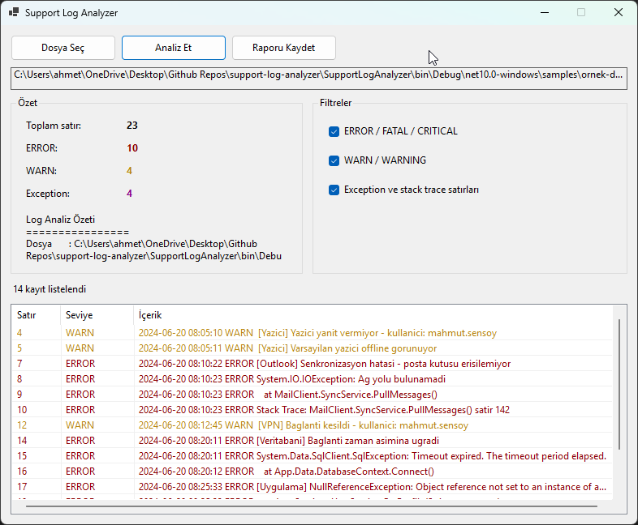
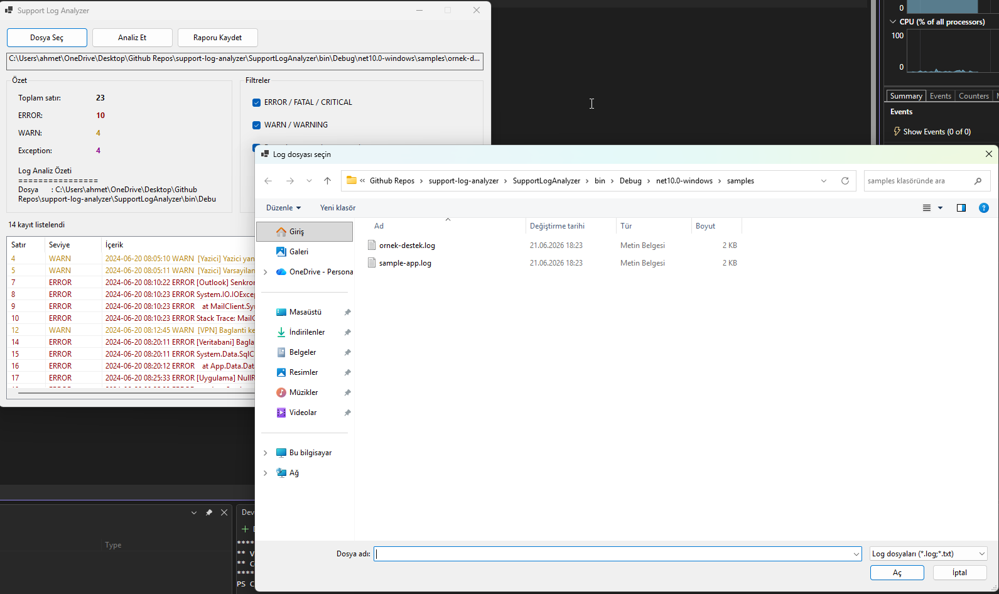

# Support Log Analyzer

Destek sürecinde sık karşılaşılan bir durum: kullanıcıdan log dosyası isteniyor, dosya gelince yüzlerce satır arasında ERROR ve WARN satırları tek tek aranıyor. Bu küçük Windows uygulaması tam o işi yapıyor — log dosyasını seçiyorsunuz, program hata ve uyarı satırlarını ayıklayıp özetliyor.

C# ve Windows Forms ile yazdım. Amacım destek tarafında log okuma ve temel hata ayıklama adımlarını pratikte göstermekti.

## Ne yapıyor?

- `.log` veya `.txt` uzantılı düz metin log dosyası okur
- Satırlarda geçen ERROR, WARN ve Exception ifadelerini bulur
- Kaç tane hata/uyarı olduğunu özet panelde gösterir
- Eşleşen satırları listede satır numarasıyla birlikte listeler
- İsterseniz sonucu `.txt` rapor olarak kaydedebilirsiniz

Filtre kutucuklarından hangi tür satırların listeleneceğini açıp kapatabilirsiniz.

## Görünüm

`ornek-destek.log` analiz edildikten sonra ana ekran:



Visual Studio'da proje yapısı:



Solda özet sayılar, sağda filtreler, altta eşleşen log satırları listeleniyor. ERROR satırları kırmızı, WARN satırları sarı tonunda gösteriliyor.

## Nasıl çalıştırılır?

Bilgisayarda Windows 10/11 ve [.NET 10 SDK](https://dotnet.microsoft.com/download) kurulu olmalı.

**Visual Studio ile**

1. `support-log-analyzer.sln` dosyasını açın
2. F5'e basın

**Terminal ile**

```bash
dotnet build support-log-analyzer.sln
dotnet run --project SupportLogAnalyzer
```

## Denemek için

Projede hazır bir örnek log var. Uygulamayı açıp **Dosya Seç** dediğinizde `samples` klasörü açılır. Oradan `ornek-destek.log` dosyasını seçip **Analiz Et**'e basmanız yeterli.

Bu dosyada yazıcı sorunu, VPN kopması, Outlook senkron hatası, veritabanı zaman aşımı gibi tipik destek senaryoları var. Örnek kullanıcı adı olarak `mahmut.sensoy` kullandım.

## Kullanım

1. **Dosya Seç** — analiz edilecek log dosyasını seçin
2. **Analiz Et** — dosya taranır, sonuçlar ekrana gelir
3. Sağdaki filtrelerden ERROR / WARN / Exception seçimini değiştirebilirsiniz
4. **Raporu Kaydet** — özeti ve satırları bir metin dosyasına yazdırır

## Örnek çıktı

`ornek-destek.log` dosyası analiz edildiğinde kabaca şöyle bir özet çıkar:

```
Log Analiz Özeti
================
Dosya       : ornek-destek.log
Toplam satır: 22
ERROR       : 10
WARN        : 4
Exception   : 6
```

Listedeki satırlardan birkaçı:

```
[7]  [ERROR] 2024-06-20 08:10:22 ERROR [Outlook] Senkronizasyon hatasi - posta kutusu erisilemiyor
[8]  [ERROR] 2024-06-20 08:10:23 ERROR System.IO.IOException: Ag yolu bulunamadi
[12] [WARN]  2024-06-20 08:12:45 WARN  [VPN] Baglanti kesildi - kullanici: mahmut.sensoy
```

## Hangi kelimeleri arıyor?

| Tür | Örnek ifadeler |
|-----|----------------|
| Hata | ERROR, FATAL, CRITICAL |
| Uyarı | WARN, WARNING |
| Exception | Exception, Stack Trace, NullReferenceException, SqlException, IOException |

Büyük/küçük harf fark etmiyor. INFO satırları tek başına listelenmiyor; sadece toplam satır sayısına dahil ediliyor.

## Proje dosyaları

```
support-log-analyzer/
├── support-log-analyzer.sln
├── SupportLogAnalyzer/
├── samples/
│   └── ornek-destek.log
├── docs/
│   └── screenshots/
└── README.md
```

## Teknoloji

- C# / .NET 10
- Windows Forms
